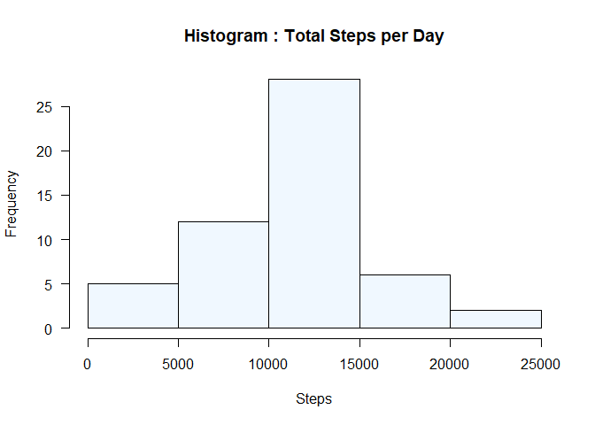
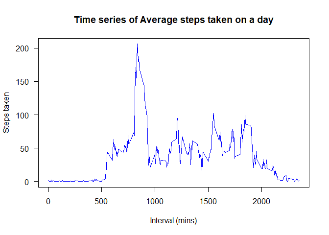
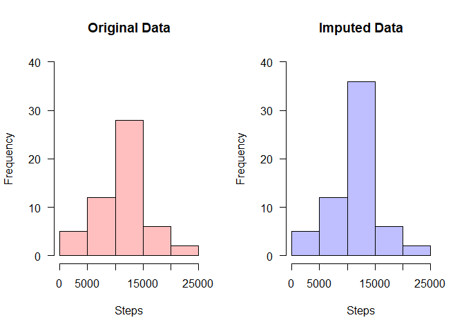

## Analysis on data from a personal activity monitoring device.

This document contains the R code, explanantion and the results for the questions in the assignment.  
    
  
### A. Loading and preprocessing the data
  
  
1. Loading and preprocessing the data  


```r
unzip("activity.zip",exdir = "data")
activityOriginal <- read.csv("data/activity.csv")
```


2. Process/transform the data into a suitable format for analysis
  
Convert the "date" field as a proper Date datatype using fucntion as.Date().  
Create a logical vector based on NA on the "steps" field and  
Create a new data frame excluding the NA values.  


```r
activityOriginal$date <- as.Date(activityOriginal[,2])
NAs <- is.na(activityOriginal$steps)
activityData <- activityOriginal[!NAs,]
```

  
  
### B. What is mean total number of steps taken per day?
  
1. Calculate the total number of steps taken per day and store 
in a new data frame.


```r
activityByDate <- setNames(aggregate(activityData$steps, 
                                     list(activityData$date), 
                                     sum),c("date","TotalSteps"))
```
  
  
  
2. prepare a histogram of total number of steps taken each day  


```r
hist(activityByDate$TotalSteps,
     main="Histogram : Total Steps per Day",
     xlab="Steps",
     col="aliceblue",
     las = 1)
```

<!-- -->


3. Mean and median of the total number of steps taken per day  


```r
summary(activityByDate$TotalSteps)[4]
```

```
##     Mean 
## 10766.19
```

```r
summary(activityByDate$TotalSteps)[3]
```

```
## Median 
##  10765
```

### C. What is the average daily activity pattern?


1. Time series plot of the 5-minute interval (x-axis) and the average number of steps taken, averaged across all days (y-axis)

   This can be done by first running the mean function by aggregating based on the intervals and stroing the result data frame in a new variable.


```r
meanByInterval <- setNames(aggregate(activityData$steps, 
                                     list(activityData$interval), 
                                     mean),c("interval","Steps")) 
```
   Ploting the data.

```r
plot(meanByInterval, type="l", col="blue",
     main= "Time series of Average steps taken on a day", 
     las=1, xlab="Interval (mins)", ylab="Steps taken" )
```

<!-- -->


2. Which 5-minute interval, on average across all the days in the dataset, contains the maximum number of steps?


```r
meanByInterval$interval[meanByInterval$Steps==(max(meanByInterval$Steps))]
```

```
## [1] 835
```
   
   
   
   
### D. Imputing missing values


1. Calculate and report the total number of missing values in the dataset (i.e. the total number of rows with NAs
   The required data is avaiable in vector NAs (refer A.2). This can be used to get the count.
   

```r
   NAsCount <- length(NAs[NAs==TRUE])
   print(NAsCount)
```

```
## [1] 2304
```


2. Strategy for filling in all of the missing values in the dataset.
   Use the mean from the time series data prepared earlier “meanByInterval”.


3. Create a new dataset "activityImputNAs" that is equal to the original dataset but with the missing data filled in.
   

   * Inlcude "dplyr" package to use the "full_join" fucntion.   
   * Run "full-join" function with the full tables "activityImputNAs" and "meanByInterval"  with "interval" as the join-key and get a vector that contains the average of the "steps" by Interval. This vector will contain one element per each observation on the full data.  
   * Update the "steps" field in the new original data frame "activityImputNAs"  with the average vector, but ony for the ones with NA.  


```r
library(dplyr)

activityImputNAs <- activityOriginal

AverageForNAs <- full_join(activityImputNAs, meanByInterval, by="interval" )[,4]

activityImputNAs$steps[NAs==TRUE] <- round(AverageForNAs[NAs],0)
```


4. Make a histogram of the total number of steps taken each day and Calculate and report the mean and median total number of steps taken per day. Do these values differ from the estimates from the first part of the assignment? What is the impact of imputing missing data on the estimates of the total daily number of steps?

   
   * Calculate the total number of steps taken per day using the imputed data. 


```r
activityByDateNA <- setNames(aggregate(activityImputNAs$steps, 
                                       list(activityImputNAs$date), 
                                       sum),c("date","TotalSteps"))
```
   
   
   * Mean and median of the total number of steps taken per day using the imputed data. 


```r
summary(activityByDateNA$TotalSteps)[4]
```

```
##     Mean 
## 10765.64
```

```r
summary(activityByDateNA$TotalSteps)[3]
```

```
## Median 
##  10762
```

   * prepare a histogram of total number of steps taken each day using the imputed data for comparison against the original data.

##### Histograms for comparing Total Steps per Day between the original and imputed data.

```r
par(mfrow = c(1,2))

hist(activityByDate$TotalSteps,
     main="Original Data",
     xlab="Steps",
     col=rgb(1,0,0,1/4),
     las = 1,
     ylim=c(0,40))

hist(activityByDateNA$TotalSteps,
     main="Imputed Data",
     xlab="Steps",
     col=rgb(0,0,1,1/4),
     las = 1,
     ylim=c(0,40)
     )
```

<!-- -->


### E. Are there differences in activity patterns between weekdays and weekends?

   1. Create a new factor variable in the dataset with two levels – “weekday” and “weekend” indicating whether a given date is a weekday or weekend day.

   2. Make a panel plot containing a time series plot of the 5-minute interval (x-axis) and the average number of steps taken, averaged across all weekday days or weekend days (y-axis). See the README file in the GitHub repository to see an example of what this plot should look like using simulated data.
   
   * Using date field, create a vector "WDcalday" with the weekday names.
   * Using vector "WDcalday" create a logical vector which will have "TRUE" for weekends and "FALSE" for weekdays.
   * Create new column "wdfactor" in data frame "activityData" and assign values "weekday" or "weekend" based on the logical vector "WDLogical"
   

```r
WDcalday  <- weekdays(activityData$date)
WDLogical <- WDcalday=="Saturday" | WDcalday=="Sunday"

activityData$wdfactor[WDLogical]  <- "weekend"
activityData$wdfactor[!WDLogical] <- "weekday"
```

   * Prepare the data and histograms for the weekday and weekend mean data for comparison.

```r
library(lattice)

activityDataWDSplit <- aggregate(steps~interval+wdfactor, data = activityData, mean)

xyplot(steps ~ interval | wdfactor, data = activityDataWDSplit, layout = c(1,2), type = "l")
```

<!-- -->
